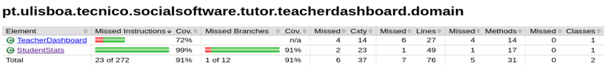

# ES P1 submission, Group 30

## Feature ESA

### Subgroup
 - João André Roque Costa, ist199088, [GitLab link](https://gitlab.rnl.tecnico.ulisboa.pt/ist199088)
   + Issues assigned: [#8](https://gitlab.rnl.tecnico.ulisboa.pt/es/es23-30/-/issues/8), [#10](https://gitlab.rnl.tecnico.ulisboa.pt/es/es23-30/-/issues/10), [#19](https://gitlab.rnl.tecnico.ulisboa.pt/es/es23-30/-/issues/19), [#20](https://gitlab.rnl.tecnico.ulisboa.pt/es/es23-30/-/issues/20), [#21](https://gitlab.rnl.tecnico.ulisboa.pt/es/es23-30/-/issues/21), [#22](https://gitlab.rnl.tecnico.ulisboa.pt/es/es23-30/-/issues/22)
 - Diogo Luís Brás de Azevedo Fonseca
, ist199065, [GitLab link](https://gitlab.rnl.tecnico.ulisboa.pt/ist199065)
   + Issues assigned: [#8](https://gitlab.rnl.tecnico.ulisboa.pt/es/es23-30/-/issues/8), [#10](https://gitlab.rnl.tecnico.ulisboa.pt/es/es23-30/-/issues/10), [#19](https://gitlab.rnl.tecnico.ulisboa.pt/es/es23-30/-/issues/19), [#20](https://gitlab.rnl.tecnico.ulisboa.pt/es/es23-30/-/issues/20), [#21](https://gitlab.rnl.tecnico.ulisboa.pt/es/es23-30/-/issues/21), [#22](https://gitlab.rnl.tecnico.ulisboa.pt/es/es23-30/-/issues/22)
 
### Merge requests associated with this feature

The list of pull requests associated with this feature is:

 - [MR #2](https://gitlab.rnl.tecnico.ulisboa.pt/es/es23-30/-/merge_requests/2)

### Test Coverage Screenshot

---

## Feature ESQ

### Subgroup
 - André Morgado, ist192737, [GitLab link](https://gitlab.rnl.tecnico.ulisboa.pt/ist192737)
   + Issues assigned: [#15](https://gitlab.rnl.tecnico.ulisboa.pt/es/es23-30/-/issues/15), [#17](https://gitlab.rnl.tecnico.ulisboa.pt/es/es23-30/-/issues/17), [#18](https://gitlab.rnl.tecnico.ulisboa.pt/es/es23-30/-/issues/18), [#16](https://gitlab.rnl.tecnico.ulisboa.pt/es/es23-30/-/issues/16), [#13](https://gitlab.rnl.tecnico.ulisboa.pt/es/es23-30/-/issues/13), [#14](https://gitlab.rnl.tecnico.ulisboa.pt/es/es23-30/-/issues/14)
 - João Diegues, ist190118, [GitLab link](https://gitlab.rnl.tecnico.ulisboa.pt/ist190118)
   + Issues assigned: [#15](https://gitlab.rnl.tecnico.ulisboa.pt/es/es23-30/-/issues/15), [#17](https://gitlab.rnl.tecnico.ulisboa.pt/es/es23-30/-/issues/17), [#18](https://gitlab.rnl.tecnico.ulisboa.pt/es/es23-30/-/issues/18), [#16](https://gitlab.rnl.tecnico.ulisboa.pt/es/es23-30/-/issues/16), [#13](https://gitlab.rnl.tecnico.ulisboa.pt/es/es23-30/-/issues/13), [#14](https://gitlab.rnl.tecnico.ulisboa.pt/es/es23-30/-/issues/14)
 
### Merge requests associated with this feature

The list of pull requests associated with this feature is:

 - [MR #1](https://gitlab.rnl.tecnico.ulisboa.pt/es/es23-30/-/merge_requests/1)

### Test Coverage Screenshot

---

## Feature ESP

### Subgroup
 - Name, istID, [GitLab link](https://gitlab.rnl.tecnico.ulisboa.pt/istXXXXXX)
   + Issues assigned: [#1](https://gitlab.rnl.tecnico.ulisboa.pt/es), [#3](https://gitlab.rnl.tecnico.ulisboa.pt/es)
 - Name, istID, [GitLab link](https://gitlab.rnl.tecnico.ulisboa.pt/istXXXXXX)
   + Issues assigned: [#2](https://github.com), [#4](https://github.com)
 
### Merge requests associated with this feature

The list of pull requests associated with this feature is:

 - [MR #1](https://gitlab.rnl.tecnico.ulisboa.pt/es)
 - [MR #2](https://gitlab.rnl.tecnico.ulisboa.pt/es)
 - [MR #3](https://gitlab.rnl.tecnico.ulisboa.pt/es)

### Test Coverage Screenshot

---