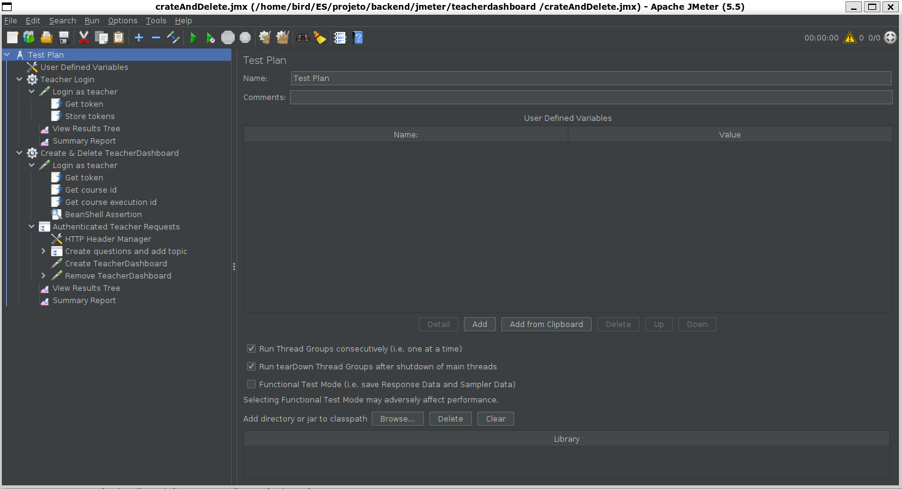

# ES P3 submission, Group 30

## Did your group use the base code provided?

Yes

## Feature ESA

  ### Subgroup
 - João André Roque Costa, ist199088, [GitLab link](https://gitlab.rnl.tecnico.ulisboa.pt/ist199088)
   + Issues assigned: [#62](https://gitlab.rnl.tecnico.ulisboa.pt/es/es23-30/-/issues/62), [#63](https://gitlab.rnl.tecnico.ulisboa.pt/es/es23-30/-/issues/63)
 - Diogo Luís Brás de Azevedo Fonseca
, ist199065, [GitLab link](https://gitlab.rnl.tecnico.ulisboa.pt/ist199065)
   + Issues assigned: [#62](https://gitlab.rnl.tecnico.ulisboa.pt/es/es23-30/-/issues/62), [#63](https://gitlab.rnl.tecnico.ulisboa.pt/es/es23-30/-/issues/63) 
 
### Merge requests associated with this feature

The list of pull requests associated with this feature is:

 no merge request since it didnt go into master, gut merge commit to dev is
 - [this](https://gitlab.rnl.tecnico.ulisboa.pt/es/es23-30/-/commit/7a757237bafe1602eb5310b1c295e3a6a7de98d2)

### JMeter Load test

  - JMeter test: get
  

### Cypress end-to-end tests

- Data initialization: explain how and where you have initialized the data for your tests.

- [Cypress test 3](https://media.discordapp.net/attachments/762368964289757194/1096453303644213339/image.png?width=661&height=671)

---

## Feature ESQ

### Subgroup
 - André Morgado, ist192737, [GitLab link](https://gitlab.rnl.tecnico.ulisboa.pt/ist192737)
   + Issues assigned: [#55](https://gitlab.rnl.tecnico.ulisboa.pt/es/es23-30/-/issues/55), [#54](https://gitlab.rnl.tecnico.ulisboa.pt/es/es23-30/-/issues/54), [#59](https://gitlab.rnl.tecnico.ulisboa.pt/es/es23-30/-/issues/59), [#64](https://gitlab.rnl.tecnico.ulisboa.pt/es/es23-30/-/issues/64)
 - João Diegues, ist190118, [GitLab link](https://gitlab.rnl.tecnico.ulisboa.pt/ist190118)
   + Issues assigned: [#55](https://gitlab.rnl.tecnico.ulisboa.pt/es/es23-30/-/issues/55), [#54](https://gitlab.rnl.tecnico.ulisboa.pt/es/es23-30/-/issues/54), [#59](https://gitlab.rnl.tecnico.ulisboa.pt/es/es23-30/-/issues/59), [#64](https://gitlab.rnl.tecnico.ulisboa.pt/es/es23-30/-/issues/64)
 
### Merge requests associated with this feature

The list of pull requests associated with this feature is:

 - [MR #10](https://gitlab.rnl.tecnico.ulisboa.pt/es/es23-30/-/merge_requests/10)
 - [MR #11](https://gitlab.rnl.tecnico.ulisboa.pt/es/es23-30/-/merge_requests/11)
 - [MR #2](https://gitlab.rnl.tecnico.ulisboa.pt/es/es23-30/-/merge_requests/12)

### JMeter Load test

  - JMeter test: create → remove
  
  

### Cypress end-to-end tests

- Data initialization: with SQL directly from the database.

- [Cypress test 1](https://gitlab.rnl.tecnico.ulisboa.pt/es)

---

## Feature ESP

### Subgroup
 - Bernardo Nunes, istID, [GitLab link](https://gitlab.rnl.tecnico.ulisboa.pt/istXXXXXX)
   + Issues assigned:  [#54](https://gitlab.rnl.tecnico.ulisboa.pt/es/es23-30/-/issues/54), [#55](https://gitlab.rnl.tecnico.ulisboa.pt/es/es23-30/-/issues/55)
 - Vasco Vaz, ist199133, [GitLab link](https://gitlab.rnl.tecnico.ulisboa.pt/ist199133)
   + Issues assigned: [#60](https://gitlab.rnl.tecnico.ulisboa.pt/es/es23-30/-/issues/60), [#63](https://gitlab.rnl.tecnico.ulisboa.pt/es/es23-30/-/issues/63)
 
### Merge requests associated with this feature

The list of pull requests associated with this feature is:

 - [MR #1](https://gitlab.rnl.tecnico.ulisboa.pt/es)

### JMeter Load test

### Cypress end-to-end tests

- Data initialization: explain how and where you have initialized the data for your tests.

- The Cypress test is incomplete, which caused the incapacity of produce a screen shot of the test required.
The error is the same as the sub-group ESA but we did not manage to put a image of that same error in the report.

---
